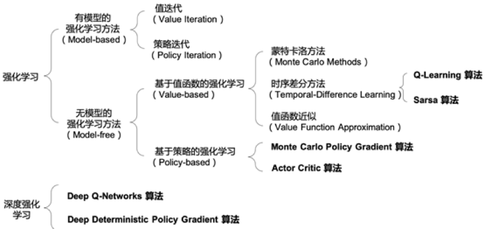

```diff
- 因子图部分链接尚未补充完全
```

__TODO List__
- [ ] 因子图部分超链接
- [ ] 强化学习部分目录结构调整
- [ ] 机器学习其他待苏然添加

- [机器学习](#机器学习)
  - [模式识别](#模式识别)
    - [图&emsp;书](#图书)
  - [深度学习](#深度学习)
    - [图&emsp;书](#图书-1)
  - [强化学习](#强化学习)
    - [图&emsp;书](#图书-2)
    - [课&emsp;程](#课程)
    - [实&emsp;战](#实战)
    - [扩展知识](#扩展知识)
    - [论&emsp;文](#论文)
      - [综&emsp;述](#综述)
      - [算&emsp;法](#算法)
    - [强化学习基本概念](#强化学习基本概念)
    - [基于值函数的强化学习方法](#基于值函数的强化学习方法)
    - [基于策略的强化学习方法](#基于策略的强化学习方法)
    - [基于值函数和策略的结合](#基于值函数和策略的结合)
    - [深度强化学习](#深度强化学习)
      - [RL热点问题](#rl热点问题)
- [因子图 （Factor Graph）](#因子图-factor-graph)
  - [1 因子图与和积算法](#1-因子图与和积算法)
    - [其他材料](#其他材料)
  - [2 信念传播](#2-信念传播)
    - [2.1 信念传播算法](#21-信念传播算法)
    - [相关论文](#相关论文)
    - [2.2 循环信念传播](#22-循环信念传播)
    - [相关论文](#相关论文-1)
    - [其他材料](#其他材料-1)
  - [3 因子图代码实现](#3-因子图代码实现)
    - [3.1 matlab代码实现](#31-matlab代码实现)
      - [相关网页](#相关网页)
    - [3.2 Julia代码实现](#32-julia代码实现)
      - [3.2.1 Julia安装](#321-julia安装)
      - [相关网页](#相关网页-1)
      - [相关论文](#相关论文-2)
      - [其他材料](#其他材料-2)
      - [3.2.2 forneyLab工具箱的使用](#322-forneylab工具箱的使用)
      - [相关网页](#相关网页-2)
      - [相关论文](#相关论文-3)
  - [4 因子图扩展](#4-因子图扩展)
    - [4.1 因子图约束](#41-因子图约束)
      - [相关论文](#相关论文-4)
    - [4.2 BP算法的粒子化](#42-bp算法的粒子化)
      - [相关论文](#相关论文-5)
      - [其他材料](#其他材料-3)
    - [4.3 因子图与粒子滤波](#43-因子图与粒子滤波)
      - [相关论文](#相关论文-6)
    - [4.4 因子图与协同网络](#44-因子图与协同网络)
      - [相关论文](#相关论文-7)
      - [其他材料](#其他材料-4)

- - -
# 机器学习
## 模式识别
### 图&emsp;书
[__《Bishop Pattern Recognition and Machine Learning》__](./机器学习/深度学习/图书/Bishop-Pattern-Recognition-and-Machine-Learning-2006.pdf) by _Christopher M. Bishop_  
[__《PRML：模式识别与机器学习(中文版)》__](./机器学习/深度学习/图书/《PRML：模式识别与机器学习(中文版)》.pdf) by _马春鹏_

## 深度学习
### 图&emsp;书
[__《Deep Learning》__](./机器学习/深度学习/图书/DeepLearning.pdf) by _Ian Goodfellow, Yoshua Bengio, Aaron Courville_  
[__《深度学习-中文》__](./机器学习/深度学习/图书/深度学习-中文.pdf) by _Ian Goodfellow, Yoshua Bengio, Aaron Courville_ Git Hub开源翻译  
[__《神经网络与深度学习》__](./机器学习/深度学习/图书/神经网络与深度学习-邱锡鹏.pdf) by _邱锡鹏_

## 强化学习
### 图&emsp;书

[__《Reinforcement Learning: An Inroduction》__](./机器学习/强化学习/图书/ReinforcementLearning_2rd_trimmed.pdf) by _Richard S. Sutton, Andrew G. Barto_ [[website]](http://incompleteideas.net/book/the-book-2nd.html)  
简短翻译版-[强化学习导论.pdf](./机器学习/强化学习/图书/强化学习导论翻译-来自CSDN.pdf) 来自 _网友_  
[__《Algorithms for Reinforcement Learning》__](./机器学习/强化学习/图书/Algorithms%20for%20Reinforcement%20Learning.pdf) by _Csaba Szepesv´ari_  
[__《A Concise Introduction to Decentrakuzed POMDPs》__](./机器学习/强化学习/图书/A%20Concise%20Introduction%20to%20Dec-POMDPs-OliehoekAmato16book.pdf) by _Oliehoed, Amato_

### 课&emsp;程

[李宏毅-主页](https://speech.ee.ntu.edu.tw/~hylee/), [强化学习课程视频](https://www.youtube.com/watch?v=XWukX-ayIrs&list=PLJV_el3uVTsMhtt7_Y6sgTHGHp1Vb2P2J&index=29)
> 优质笔记(<https://datawhalechina.github.io/easy-rl/>)

[David Silver主页](https://www.davidsilver.uk/teaching/), [课程视频](https://www.youtube.com/watch?v=2pWv7GOvuf0)

[伯克利2018强化学习课程](http://rail.eecs.berkeley.edu/deeprlcourse/)


### 实&emsp;战
基于SMAC的PYMARL平台  __GitHub__ 地址<https://github.com/oxwhirl/pymarl>
百度PaddlePaddle工程师实训教程--视频<https://www.bilibili.com/video/BV1yv411i7xd>  
> [Baidu AI-Studio课程](https://aistudio.baidu.com/aistudio/course/introduce/1335)  
> 项目代码PRAL [GitHub](https://github.com/PaddlePaddle/PARL)

### 扩展知识

POMDPs介绍--[Pages](http://cs.brown.edu/research/ai/pomdp/)

### 论&emsp;文
#### 综&emsp;述
[__Deep Reinforcement Learning: An Overview__](./机器学习/强化学习/论文/DEEP%20REINFORCEMENT%20LEARNING%20AN%20OVERVIEW.pdf)  
[__Multi-agent reinforcement learning: An overview.__ _Buşoniu L, Babuška R, De Schutter B._]()  
[__An overview of recent progress in the study of distributed multi-agent coordination.__ _Cao Y, Yu W, Ren W, et al._](./机器学习/强化学习/论文)  
#### 算&emsp;法
- **Q-Learning**--[Q-learning](./机器学习/强化学习/论文/Watkins-Dayan1992_Article_Q-learning.pdf)
- **DQN**----[Human-level Control Through Deep Reinforcement Learning](./机器学习/强化学习/论文/DQN-Human-level%20Control%20Through%20Deep%20Reinforcement%20Learning.pdf)
- **VDN**----[Value-Decomposition Networks For Cooperative](./机器学习/强化学习/论文/VDN-Value-Decomposition%20Networks%20For%20Cooperative.pdf)
- **DRQN**---[Deep Recurrent Q-Learning for Partially Observable MDPs](./机器学习/强化学习/论文/DRQN-Deep%20Recurrent%20Q-Learning%20for%20Partially%20Observable%20MDPs.pdf)
- **QMIX**---[Monotonic Value Function Factorisation for Deep Multi-Agent Reinforcement Learning](./机器学习/强化学习/论文/QMIX-Monotonic%20Value%20Function%20Factorisation%20for%20Deep%20Multi-Agent%20Reinforcement%20Learning.pdf)
- **ROMA**---[Multi-Agent Reinforcement Learning with Emergent Roles](./机器学习/强化学习/论文/ROMA%20Multi-Agent%20Reinforcement%20Learning%20with%20Emergent%20Roles.pdf)
- **COMA**----[Counterfactual Multi-Agent Policy Gradients](https://arxiv.org/abs/1705.08926)
- **IQL**-----[Independent Q-Learning](https://arxiv.org/abs/1511.08779)
- **QTRAN**---[Learning to Factorize with Transformation for Cooperative Multi-Agent Reinforcement Learning](https://arxiv.org/abs/1905.05408)

### 强化学习基本概念

1. 智能体、环境、策略、奖励、状态转移概念

   参考：[*神经网络与深度学习.PDF*](./强化学习资料/神经网络与深度学习.PDF)、[*强化学习导论sutton1_13.PDF*](./强化学习资料/强化学习导论sutton1_13.PDF)

2. 马尔可夫决策过程（MDP）、部分可观测马尔可夫决策过程(POMDP)、分布式部分马尔可夫决策过程(Dec-POMDP)

   1. MDP

      [*A Markovian Decision Process*](./机器学习/强化学习/论文/A%20Markovian%20Decision%20Process.pdf)

      [*Dynamic Programming and Markov Processes*](./机器学习/强化学习/论文/Dynamic%20Programming%20and%20Markov%20Processes.pdf)

   2. POMDP

      [*Optimal Control of Markov Processes with Incomplete State Information*](./机器学习/强化学习/论文/Optimal%20Control%20of%20Markov%20Processes%20with%20Incomplete%20State%20Information.pdf)

      [*Planning and acting in partially observable stochastic domains*](./机器学习/强化学习/论文/Planning%20and%20acting%20in%20partially%20observable%20stochastic%20domains.pdf)

   3. Dec-POMDP

      [*The Complexity of Decentralized Control of Markov Decision Processes*](./机器学习/强化学习/论文/The%20Complexity%20of%20Decentralized%20Control%20of%20Markov%20Decision%20Processes.pdf)

      [*A Concise Introduction to Decentralized POMDPs*](./机器学习/强化学习/论文/A%20Concise%20Introduction%20to%20Decentralized%20POMDPs.pdf)

3. 强化学习算法分类
   - Model-Free和Model-Based  
   - Policy-Based和Value-Based  
   - On-Policy和Off-Policy  
   - 对比及介绍：*<https://www.cnblogs.com/liuxgblog/p/14698204.html>*  
   
4. 强化学习算法测试环境

   **Gym**

   介绍：*https://gym.openai.com/*

   安装及使用：[*openAI Gym介绍.pptx*](./机器学习/强化学习/论文/openAI%20Gym介绍.pptx) [openai gym.docx](./机器学习/强化学习/论文/openai%20gym.docx)

   **MPE**

   安装及使用：*https://github.com/openai/multiagent-particle-envs*

   **星际争霸**

### 基于值函数的强化学习方法

1. 动态规划算法

2. 蒙特卡罗算法

3. 时序差分学习方法

   Sarsa 和Q-learning：*https://zhuanlan.zhihu.com/p/46850008*

### 基于策略的强化学习方法

1. 策略梯度

   特点：处理连续动作和随机策略

   介绍：[*Policy Gradient Methods for Reinforcement Learning with Function Approximation*](./机器学习/强化学习/论文/Policy_Gradient_Methods_for_Reinforcement_Learning.pdf)

2. Reinforce算法

3. 带基线的Reinforce算法

   特点：减少方差

### 基于值函数和策略的结合

1. Actor-Critic算法

   特点：使用Q函数减少方差

   介绍：[*Policy Gradient Methods for Reinforcement Learning with Function Approximation*](./强化学习资料/Policy_Gradient_Methods_for_Reinforcement_Learning.pdf)

2. A2C 

   特点：使用优势函数减少方差

   介绍：*https://openai.com/blog/baselines-acktr-a2c/*

3.  A3C

   特点：多线程

   介绍：[*Asynchronous Methods for Deep Reinforcement Learning.*](./机器学习/强化学习/论文/Asynchronous%20Methods%20for%20Deep%20Reinforcement%20Learning.pdf)

**以上三节参考**：[强化学习value-based&policy-based.pptx](./强化学习资料/强化学习value-based&policy-based.pptx)

### 深度强化学习

1. DQN

   介绍：[*Playing Atari with Deep Reinforcement Learning*](./机器学习/强化学习/论文/Playing%20Atati%20with%20Deep%20Reinforcement%20Learning.pdf)

2. Nature DQN

   介绍：[*Human-level control through deep reinforcement learning*](./强化学习资料/Human-level%20Control%20Through%20Deep%20Reinforcement%20Learning.pdf)

3. Double DQN (DDQN)

   介绍：[*Deep Reinforcement Learning with Double Q-learning*](./强化学习资料/Deep_Reinforcement_Learning_with_Double_Q-learning.pdf)

4. Dueling DQN

   介绍：[*Dueling Network Architectures for Deep Reinforcement Learning*](./机器学习/强化学习/论文/Dueling_Network_Architectures_for_Deep_Reinforceme.pdf)

   DQN及其变体介绍：*https://zhuanlan.zhihu.com/p/106411995*

5. DPG

   介绍：[*Deterministic Policy Gradient Algorithms*](./机器学习/强化学习/论文/Deterministic%20Policy%20Gradient%20Algorithms.pdf)

6. DDPG

   介绍：[*Continuous Control with Deep Reinforcement Learning*](./机器学习/强化学习/论文/CONTINUOUS%20CONTROL%20WITH%20DEEP%20REINFORCEMENT.pdf)

7. MADDPG

   介绍：[*multi-agent actor-critic for mixed cooperative-competitive environments*](./机器学习/强化学习/论文/multi-agent%20actor-critic%20for%20mixed%20cooperative-competitive%20environments.pdf)

#### RL热点问题

- **多智能体协作**

   [*PRIMAL: Pathfinding via Reinforcement and Imitation Multi-Agent Learning*](./机器学习/强化学习/论文/Pathfinding%20via%20Reinforcement%20and%20Imitation%20Multi-Agent%20Learning.pdf)

   [*CM3:cooperative_multi_goal_multi_stage_multi_agent_reinforcement_learning*](./机器学习/强化学习/论文/cm3_cooperative_multi_goal_multi_stage_multi_agent_reinforcement_learning.pdf)

- **信用分配**

   [*Counterfactual multi-agent policy gradients*](./机器学习/强化学习/论文/Counterfactual%20multi-agent%20policy%20gradients.pdf)

   [*Force-Based Algorithm for Motion Planning of Large Agent*](./机器学习/强化学习/论文/Force-Based%20Algorithm%20for%20Motion%20Planning%20of%20Large%20Agent.pdf)

   [*NIPS-2003-all-learning-is-local-multi-agent-learning-in-global-reward-games-Paper*](./机器学习/强化学习/论文/NIPS-2003-all-learning-is-local-multi-agent-learning-in-global-reward-games-Paper.pdf)

   [*Sequential Q-Learning With Kalman Filtering for Multirobot Cooperative Transportation*](./机器学习/强化学习/论文/Sequential%20Q-Learning%20With%20Kalman%20Filtering%20for%20Multirobot%20Cooperative%20Transportation.pdf)


# 因子图 （Factor Graph）
## 1 因子图与和积算法

|  相关网页    |
|  :-----  | 
| [概率图的推断——变量消除、信念传播、因子图、道德图、联结树](https://blog.csdn.net/yao09605/article/details/104622655/)  | 
| 以一个例子讲述因子图为何以及如何进行计算。  | 
| [因子图与和积算法简介(CSDN)](https://blog.csdn.net/sinat_38151275/article/details/83621805)  | 
| 出自论文[__factor graph and sum-product algorithm__](./因子图梳理/1%20因子图定义与和积算法/factor%20graph%20and%20sum-product%20algorithm.pdf)  | 
| [因子图与和积算法简介(知乎)](https://zhuanlan.zhihu.com/p/84210564)  | 
| 出自论文[__factor graph and sum-product algorithm__](./因子图梳理/1%20因子图定义与和积算法/factor%20graph%20and%20sum-product%20algorithm.pdf)与上一个链接内容相比，对因子图定义的形式化描述更多。 | 


|  相关论文    |
|  :-----  | 
| [<strong>An introduction to factor graph</strong>](./因子图梳理/1%20因子图定义与和积算法/An%20introduction%20to%20factor%20graphs.pdf)  | 
| 本文讲述因子图的发展过程，并给出两种形式的因子图：标准形式、Forney形式。 介绍了LDPC码、卡尔曼滤波等应用与因子图上的例子。  | 
| [因子图与和积算法简介(CSDN)](https://blog.csdn.net/sinat_38151275/article/details/83621805)  | 
| 出自论文[__factor graph and sum-product algorithm__](./因子图梳理/1%20因子图定义与和积算法/factor%20graph%20and%20sum-product%20algorithm.pdf)。  | 
| [因子图与和积算法简介(知乎)](https://zhuanlan.zhihu.com/p/84210564)  | 
| 出自论文[__factor graph and sum-product algorithm__](./因子图梳理/1%20因子图定义与和积算法/factor%20graph%20and%20sum-product%20algorithm.pdf)。与上一个链接内容相比，对因子图定义的形式化描述更多。 | 


### 其他材料
| [SRTP因子图项目报告](./因子图梳理/1%20因子图定义与和积算法/srtp报告.docx) |
| :-|
| 课题名为：“实现信息融合的因子图可视化设计”。描述了因子图定义以及各种算法，并进行仿真实验设计|

## 2 信念传播
### 2.1 信念传播算法
### 相关论文
<table>
  <tr>
      <td><a href=""><strong>Max-product for maximum weight matching   Convergence correctness and LP duality</strong></a></td>
  </tr>
  <tr>
    <td>本文介绍最大积算法并证明其在循环图中的正确性和收敛性</td>
  </tr>
  <tr>
    <td><a href=""><strong>Message-passing algorithms for inference</strong></a></td>
  </tr>
  <tr>
    <td>本文描述了一系列信念传播算法，包括最小和算法、基于自由能的BP算法、“tree-reweighted"BP算法等。</td>
  </tr>
  <tr>
    <td><a href=""><strong>Understanding Belief Propogation</strong></a></td>
  </tr>
<table>

### 2.2 循环信念传播

### 相关论文
<table>
  <tr>
    <td><a href=""><strong>Loopy belief propagation based data association for extended target tracking</strong></a></td>
  </tr>
  <tr>
    <td>本文提出一种多扩展目标跟踪数据关联的图形模型公式，并且可以通过循环信念传播来求解</td>
  </tr>
<table>

### 其他材料
<table>
  <tr>
      <td><a  style="text-decoration:none" href="https://metacademy.org/graphs/concepts/loopy_bp_as_variational">Metacademy课程:循环信念传播与变分推理</a></td>
  </tr>
  <tr>
    <td>metacademy是一个网站，其可以看作机器学习和人工智能的知识图谱</td>
  </tr>
  <tr>
    <td>[word文档]LBP论文笔记</td>
  </tr>
  <tr>
    <td>简单介绍了LBP算法，并简单推导了<strong>Loopy belief propagation based data association for extended target tracking</strong>中的部分因子图</td>
  </tr>
<table>


## 3 因子图代码实现
### 3.1 matlab代码实现
#### 相关网页
<table>
  <tr>
      <td><a  style="text-decoration:none" href="https://wenku.baidu.com/view/dfe4e58f7d192279168884868762caaedc33ba07.html">因子图与和积算法-matlab代码实现</a></td>
  </tr>
  <tr>
    <td>此文档先对因子图与和计算法进行讲解，其出自<strong>An introduction to factor graph</strong>。文档基于因子图给出奇偶校验、马尔可夫链、卡尔曼滤波的matlab实现</td>
  </tr>
<table>


### 3.2 Julia代码实现
#### 3.2.1 Julia安装
#### 相关网页
<table>
  <tr>
      <td><a  style="text-decoration:none" href="https://cn.julialang.org/">Julia中文社区</a></td>
  </tr>
  <tr>
      <td><a  style="text-decoration:none" href="https://juliaobserver.com/packages">Julia的package查询网站</a></td>
  </tr>
  <tr>
    <td>可查询Julia支持的所有第三方package，并且可以查询其版本更新情况与package间依赖关系</td>
  </tr>
  <tr>
    <td><a  style="text-decoration:none" href="https://discourse.juliacn.com/t/topic/736">Julia中镜像站的使用</td>
  </tr>
  <tr>
    <td>教授如何在Julia中用中国镜像源进行package下载</td>
  </tr>
<table>


#### 相关论文
<table>
  <tr>
    <td>[论文]<strong>julia in machine learning</strong></td>
  </tr>
  <tr>
    <td>本文简单介绍了Julia语言，并于传统的python、matlab进行比较</td>
  </tr>
<table>

#### 其他材料
<table>
  <tr>
    <td>[word文档]Julia安装流程</td>
  </tr>
  <tr>
    <td>对网上的安装流程做出总结，给出了几个可行的安装方法</td>
  </tr>
<table>

#### 3.2.2 forneyLab工具箱的使用

#### 相关网页
<table>
  <tr>
      <td><a  style="text-decoration:none" href="https://nbviewer.jupyter.org/github/bertdv/BMLIP/blob/master/lessons/notebooks/Factor-Graphs.ipynb">forneylab的简单demo</a></td>
  </tr>
  <tr>
    <td><a  style="text-decoration:none" href="https://github.com/biaslab/ForneyLab.jl">forneylab在github上的开源地址</td>
  </tr>
<table>


#### 相关论文
<table>
  <tr>
    <td>[论文]<strong>A factor graph approach to automated design of Bayesian</strong></td>
  </tr>
  <tr>
    <td>本文介绍其开发的ForneyLab工具箱</td>
  </tr>
<table>


## 4 因子图扩展
### 4.1 因子图约束
#### 相关论文
<table>
  <tr>
    <td>[论文]<strong>A message passing approach for multiple maneuvering target tracking</strong></td>
  </tr>
  <tr>
    <td>本文提出一种BP与MF结合的消息传递算法。用BP解决硬约束问题、用MF得到复杂模型下的消息传递更新</td>
  </tr>
  <tr>
    <td>[论文]<strong>Merging Belief Propagation and the Mean Field Approximation: A Free Energy Approach</strong></td>
  </tr>
  <tr>
    <td>本文展示如何在与BP对应的因子图中包含硬约束</td>
  </tr>
<table>

### 4.2 BP算法的粒子化
#### 相关论文
<table>
  <tr>
    <td>[论文]<strong>Sequential Particle-Based Sum-Product Algorithm for Distributed Inference in Wireless Sensor Networks</strong></td>
  </tr>
  <tr>
    <td>本文提出一种基于粒子的和积算法并且降低其复杂度为线性的</td>
  </tr>
  <tr>
    <td>[论文]<strong>Understanding and Accelerating Particle-Based Variational Inference</strong></td>
  </tr>
<table>

#### 其他材料
<table>
  <tr>
    <td>[ppt文档]Understanding and Accelerating Particle-Based Variational Inference的讲解</td>
  </tr>
<table>

### 4.3 因子图与粒子滤波
#### 相关论文
<table>
  <tr>
    <td>[论文]<strong>Nonparametric belief propagation</strong></td>
  </tr>
  <tr>
    <td>本文提出一种基于因子图上和积算法规则的粒子滤波算法</td>
  </tr>
  <tr>
    <td>[论文]<strong>Nonparametric belief propagation for self-localization of sensor networks</strong></td>
  </tr>
  <tr>
    <td>本文将NBP算法用于协同网络上的多目标定位</td>
  </tr>
<table>

### 4.4 因子图与协同网络
#### 相关论文
<table>
  <tr>
    <td>[论文]<strong>A comparison of parametric and sample-based message representation in cooperative localization</strong></td>
  </tr>
  <tr>
    <td>本文提出了基于无线网络上的和积算法实现</td>
  </tr>
  <tr>
    <td>[论文]<strong>Cooperative localization using posterior linearization belief propagation</strong></td>
  </tr>
  <tr>
    <td>本文提出一种无线网络协同定位中的后验线性化信念传播算法：PLBP</td>
  </tr>
  <tr>
    <td>[论文]<strong>A comparison of parametric and sample-based message representation in cooperative localization</strong></td>
  </tr>
  <tr>
    <td>本文提出了一种基于因子图的TOA定位算法</td>
  </tr>
<table>

#### 其他材料
<table>
  <tr>
    <td>[rar文件]PLBP算法的代码实现？</td>
  </tr>
<table>

<!-- [^zct]: 张昶天的整理
[^yinnan]: 殷楠的整理 
sycc: 石雨宸的因子图 -->